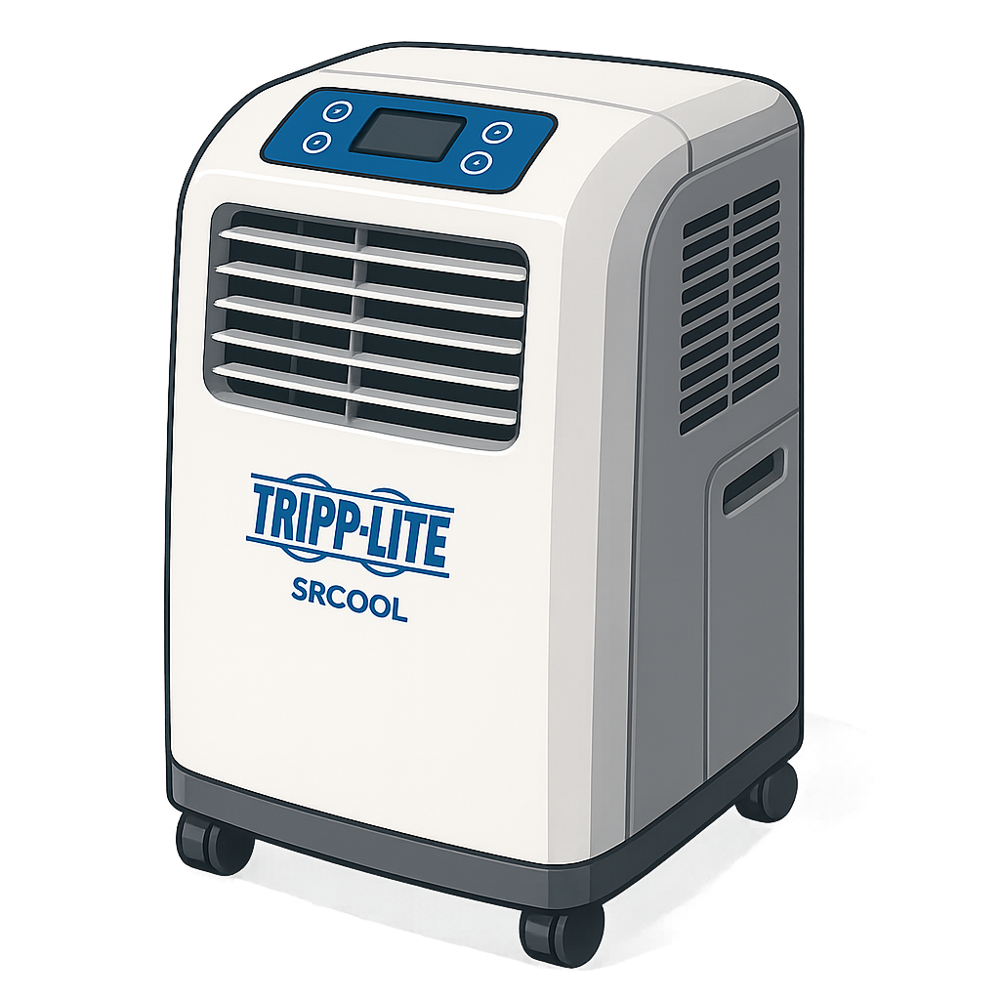

# Tripp Lite SRCOOL Custom Integration



> Control and monitor your Tripp Lite SR(X)COOL series portable air‐conditioner directly from Home Assistant over Telnet.

---

## 📝 Features

- **Climate control**  
  - Set target temperature (63 °F – 86 °F) via UI slider  
  - Change fan speed (Low, Medium, High, Auto)  
  - Toggle cooling on/off  
- **Status monitoring**  
  - Return Air Temperature  
  - Water Status (Not Full / Full)  
  - Quiet Mode (Enabled / Disabled)  
  - Auto Fan Speed (On / Off)  
- **Device info** exposed as entity attributes and sensors  
  - Device Name, Vendor, Product, Protocol, Installation Date, State, Type, Port Mode, Port Name  
- **Separate sensors** for each status field (water status, quiet mode, auto‐fan, fan speed, etc.)  
- **Config flow**–driven setup (no YAML) with reauthentication support  
- **Built‑in icon** displayed above using `icon.png`  

---

## 🔧 Prerequisites

- Home Assistant Core **2024.9** or later  
- SRCOOL unit with Telnet enabled  
- Network reachability from your HA host to the SRCOOL device  

---

## 🚀 Installation

1. Clone or download this repo into your `custom_components` folder:  
   ```bash
   mkdir -p config/custom_components/tripp_lite_srcool
   cp -R tripp_lite_srcool/* config/custom_components/tripp_lite_srcool/

